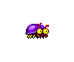
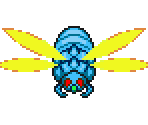
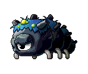
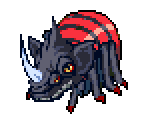

# Software Engineneering Immersive: Project 1
This was my first project built whilst studying the Software Engineering Immersive course at General Assembly.

This game was built in one week during Week 4 of the course.

# Snake 2

## Tech Stack
This project was built using the following technologies.
+ HTML5
+ CSS3
+ JavaScript
+ GitHub

## Deployment
The game is deployed utilising GitHub Pages and it can be found (and played 😉) here via this link - [Snake 2](https://latchjack.github.io/sei-project-1/)

## Getting Started
If you would like to fork/clone this game to your own repository, please feel free to do so. 

You then need to open the index.html file in your browser and the game should start. All images are stored in the games asset folder if you would like to customise the game with your own style.

## Game Architecture
Snake 2 is a single player game. The object of the game is to navigate the grid and eat as many bugs as possible, increasing your score.

The challenge is to not bump into the body of your snake which becomes more challenging as you accumulate more points, as your snake will grow longer.


To control the snake the player presses down on the `up, down, left and right` arrow keys on their keyboard to navigate across the 15 x 15 grid whilst getting closer to the bugs.

If a bug is eaten, the player's score will increase.

There are four different bugs the player can eat which all award a different number of points. 

#### Bug 1


Worth 15 points

#### Bug 2


Worth 20 points

#### Bug 3


Worth 25 points

#### Bug 4


Worth 30 points

The bugs are randomly generated so the player will never know which bug will appear next. To do this I built a function that uses the `Math.random()` function which can be seen below.

```js
//Function that creates new food for the snake on an availabe square
  function newFood() {
    const bugs = ['bug0', 'bug1', 'bug2', 'bug3']
    const randomBug = bugs[Math.floor(Math.random() * Math.floor(4))]
    const availableSquares = squares.filter(square => {
      return !square.classList.contains('player')
    })
    const foodLocation = Math.floor(Math.random() * availableSquares.length)
    const squareFood = availableSquares[foodLocation]
    console.log(squareFood)
    squareFood.classList.add('food')
    squareFood.style.backgroundImage = `url('./assets/${randomBug}.png')`
    squareFood.setAttribute('data-id', randomBug)
  }
```
When the `newFood` function is invoked, the first step is that it randomly chooses one of the 4 bugs from the `bugs` constant via the `Math.random` function in the `randomBug` constant.
It then runs a filter function on the grid array which is named `squares` and returns all squares that do not contain the class of `player` (the snake's head or body) and places them into the new array `availableSquares`.
This is done so that I can make sure the next bug that is generated doesn't appear in a square that is currently occupied.  